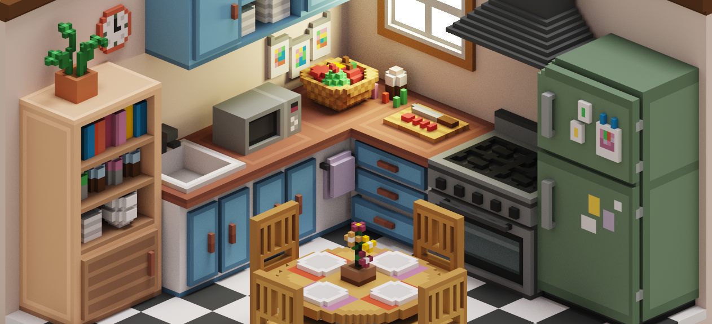
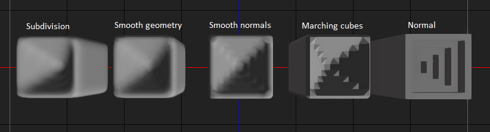

## Overview
Visit live demo - [Github Pages](https://gharielsl.github.io/voxel-mesh-editor).

The **Voxel Mesh Editor** is a tool for creating and editing voxel-based 3D models.

It allows to import and voxelize 3D models, sculpt with voxels, and to smooth out voxel meshes.

### Current and future features: 
- Object mode
    - [x] Copy paste
    - [x] Transform
    - [x] Undo
    - [x] Fly controls
- Voxel mode
    - [x] Add/Remove
    - [x] Spray
    - [x] Select
- Scene tree and property editor
    - [x] Hide/Show/Select
    - [x] March cubes
    - [x] Transform
    - [ ] Voxelize mesh
- Materials
    - [x] Selection
    - [x] Voxel mesh shader
    - [ ] Delete / Replace / Move
- Import/Export
    - [x] Save/Open
    - [x] Import
    - [ ] Export .vox
    - [x] Export GLB/GLTF
    - [ ] Bake textures
- Misc
    - [ ] Measuring
    - [ ] First person walk
    - [ ] 3d annotations

## Controls

### General
- <kbd>Left Mouse Button</kbd> + <kbd>Drag</kbd>: Orbit.
- <kbd>Right Mouse Button</kbd> + <kbd>Drag</kbd>: Fly.
- <kbd>Left Mouse Button</kbd> + <kbd>W</kbd>  <kbd>A</kbd>  <kbd>S</kbd>  <kbd>D</kbd>: Fly - move.
- <kbd>Shift</kbd> + <kbd>Drag</kbd>: Pan.
- <kbd>Tab</kbd>: Switch between object mode and voxel mode.

### Object Mode
- <kbd>T</kbd>: Translate.
- <kbd>R</kbd>: Rotate.
- <kbd>G</kbd>: Scale.
- <kbd>F</kbd>: Select.
- <kbd>Del</kbd>: Delete selected objects.
- <kbd>Ctrl</kbd> + <kbd>C</kbd>: Copy selected objects.
- <kbd>Ctrl</kbd> + <kbd>V</kbd>: Paste the copied object.

### Voxel Mode
- <kbd>Left Click</kbd>: Add a voxel.
- <kbd>Right Click</kbd>: Remove a voxel.
- <kbd>Ctrl</kbd> + <kbd>Drag</kbd>: Spray voxels.
- <kbd>Alt</kbd> + <kbd>Drag</kbd>: Select voxels.

## Smoothing Voxel Meshes
- Select the mesh.
- On the properties panel tick `march cubes`.
- Tick `smooth`.

### 5 different smoothing stages

